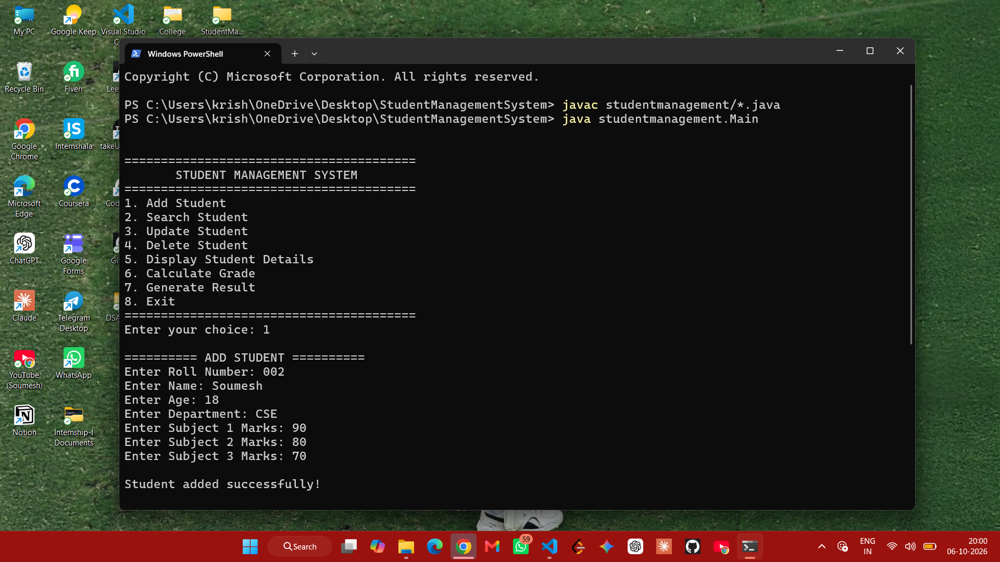
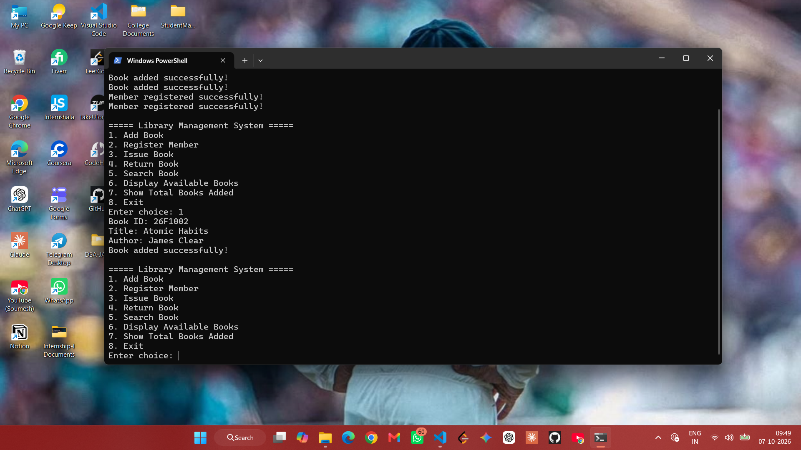

# Java Mini Project

## 📌 Project Overview

This is a simple Java-based mini project developed to demonstrate basic **Object-Oriented Programming (OOP)** concepts and Java programming fundamentals.

The project is designed to be simple, easy to understand, and suitable for a college-level Java mini project.

## 📸 Screenshots

### Screenshot 1

This screenshot shows the main interface/output of the Java mini project.



### Screenshot 2

This screenshot shows another part of the program execution and its output.




## ✨ Features

* Simple and user-friendly console interface
* Java OOP concepts
* Class and Object implementation
* Methods and constructors
* Easy-to-understand Java code
* Menu-driven program
* Basic input and output handling

## 🛠️ Technologies Used

* **Java**
* **Object-Oriented Programming**
* **Java Collections / Basic Java concepts**
* **Command Line / Terminal**

## 📂 Project Structure

```text
Java-Mini-Project/
│
├── src/
│   └── Main.java
│
├── screenshot1.png
├── screenshot2.png
└── README.md
```

## ▶️ How to Run

### 1. Clone the Repository

```bash
git clone YOUR_GITHUB_REPOSITORY_LINK
```

### 2. Open the Project

Open the project folder in **VS Code**, **IntelliJ IDEA**, **Eclipse**, or any Java-supported IDE.

### 3. Compile the Program

Open the terminal inside the project folder and run:

```bash
javac Main.java
```

### 4. Run the Program

```bash
java Main
```

Follow the instructions shown in the terminal.


## 🎯 Learning Objectives

Through this project, I practiced:

* Java programming fundamentals
* Classes and objects
* Methods and constructors
* Encapsulation
* Basic OOP implementation
* User input and output
* Writing a simple menu-driven Java application

## 👨‍💻 Author

**Soumesh Krishna Padhi**

B.Tech CSE Student

## 📄 License

This project was created for **educational and academic purposes**.
